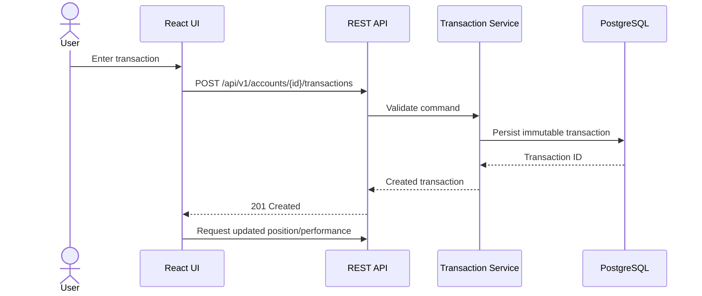
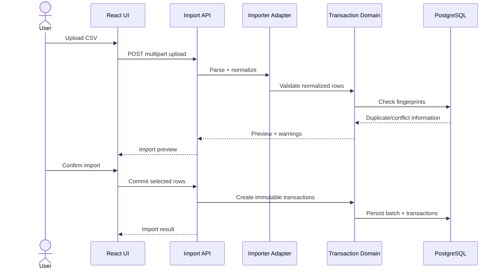

# Core Workflows

## Manual transaction



## CSV import



## Recalculation

```text
Transactions + corporate actions
              |
              v
      Position/Lot Engine
              |
              +--> Position snapshots
              |
              v
       Valuation Engine
          /         \
      Prices        FX
          \         /
           v       v
       Performance Input
              |
              v
        Return Strategies
              |
              v
        Results + warnings
```

Recalculation is deterministic for the same ledger, observations, calculation method/version and configuration.

## Account transfer

```text
Source account
  outgoing transfer event
          |
          | common transferId
          v
Destination account
  incoming transfer event

Acquisition lots/cost basis are transferred, not re-created as a new acquisition at market price.
```